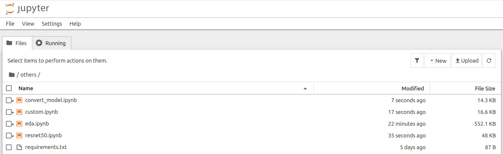

### Description
This is the capstone project for the DataTalks Club ML Zoomcamp 2024.

In this project we will build a traffic sign classification web service.

This web service will take images of traffic signs and classify them. This kind of service could also be used in a self driven car. The car cameras could scan the road for traffic signs and when they find one, the system can classify the sign so that the car could decide what to do. For example if the cameras find a STOP sign, the car would stop.

### Dataset

We will use the **GTSRB - German Traffic Sign Recognition Benchmark** dataset from Kaggle. The dataset can be found in the URL below:

https://www.kaggle.com/datasets/meowmeowmeowmeowmeow/gtsrb-german-traffic-sign

The two folders we are interested in, are:

* **Train**. All traffic sign images are stored here. You can find 43 folders, and in each folder you can find the images for a specific traffic sign. We will use this folder for model training.
* **Test**. We will use the images in this folder to test our model after it is trained.

### Tecnologies used

#### Jupyter notebook
  
Jupyter notebook is used run the **notebook.ipynb** file. We use this file for **Exploratory Data Analysis** and also for model evaluation and model selection.

#### Gunicorn
  
Gunicorn is s a Python WSGI (Web Server Gateway Interface) HTTP Server. The Flask application runs on this server.

### Flask
  
Flask is the framework which we use to create the prediction web service. 

#### Streamlit
  
Streamlit is used to create the user interface (UI). The user selects a traffic sign image file by using the **Browse files** button or by just dragging the file and the output is displayed.

#### Docker
  
We use docker to create the containers for our app. We actually have two containers. One which contains the user interface and the script that allows us to connect to the predict service, and one which is actually our predict service.

#### Scikit-learn
  
We use the **scikit-learn** python library to handle data splitting.

#### Tensorflow
  
We use the **tensorflow** library to perform the model training.

#### AWS Elastic Kubernetes Service
  
We use the AWS Elastic Kubernetes Service to build a Kubernetes cluster on the cloud and host our traffic sign classification service on this cluster.

### Application flow

Below you can see the application flow diagram.  

  

The user opens a browser and accesses a simple form which is actually a streamlit app. All the user has to do is select the desired traffic sign image **(png/jpg)** by using the **Browse files** button or by just dragging the file. The streamlit app uses a function from the **predict_service_functions.py** file to connect to the web service **(predict_service.py)**. The connection is made by using the **/predict_traffic_sign** endpoint. The **predict** function uses the model **(traffic_sign_classification_model.h5)** to predict a traffic sign class. The traffic sign class with a short description is then returned to the user and displayed below the image selection box. The **init.py** script runs when the application starts. You can read more about this script in the **Run the application** section.

### Application structure

The following folders/files are included in the application:

* **app** folder. This folder contains all the files needed for the application to run.
  * **data** folder. The application data will be stored here.
  * **model** folder. The trained model **(traffic_sign_classification_model.h5)** is stored here.
  * **docker-compose.yaml, Dockerfile.gunicorn** and **Dockerfile.streamlit** are used by docker to create the **UI** and **Classification Web Service** application containers.
  * **requirements.streamlit.txt**. All python libraries with their versions, used by the UI container are stored here.
  * **app.py**. This is the application entry point. It is the file that is loaded when the UI container starts.
  * **predict_service_functions.py** This file contains the necessary functions to connect to the traffic sign classification web service.
  * **requirements.gunicorn.txt**. All python libraries with their versions, used by the classification service container are stored here.
  * **init.py**. This file is used to perform data preparation, to split the data into train and validation datasets, to train and finally save the model.
  * **predict_service.py** This is the traffic sign classification web service. This service receives a traffic sign image in png/jpg format and returns a predicted traffic sign class.
* **eks** folder. This folder contains all the files needed for the application to run on **AWS EKS**.
  * **model** folder. The converted model **(saved_model)** is stored here.
  * **Dockerfile.gateway**, **Dockerfile.tfserving** and **Dockerfile.streamlit** are used by docker to create the **Gateway**, **Classification Web Service** and **UI** application containers.
  * **requirements.streamlit.txt**. All python libraries with their versions, used by the UI container are stored here.
  * **app.py**. This is the application entry point. It is the file that is loaded when the UI container starts.
  * **predict_service_functions.py**. This file contains the necessary functions to connect to the traffic sign classification web service.
  * **requirements.gateway.txt**. All python libraries with their versions, used by the gateway container are stored here.
  * **gateway.py**. This is the gateway web service. This service receives a traffic sign image in png/jpg format. It contacts the tf serving container by using gRPC. A predicted traffic sign class is then returned to the user.
  * **.yaml** files. Those files are used by the kubectl utiltiy to create the kubernetes cluster components.
* **others** folder. This folder contains files for model evaluation, EDA, and model conversion.
  * **eda.ipynb**. This file used for Exploratory Data Analysis.
  * **convert_model.ipynb**. This file is used to convert the **.h5** format model to the **saved_model** format.
  * **custom.ipynb**. This is a Jupyter notebook file which was used for custom model evaluation. Model creation is also performed in the **init.py** file mentioned earlier.
  * **resnet50.ipynb**. This is a Jupyter Notebook file which was used for resnet50 model evaluation.
  * **requirements.txt**. This file contains all the requirements for performing the models evaluation and the model conversion.
* **README.md**. This file.

### Install Docker and Docker Compose 
To install Docker and Docker Compose you can use the following links:

https://docs.docker.com/engine/install/  
https://docs.docker.com/compose/install/

### Run the application

#### Clone the github repository
Open a terminal, navigate to a folder where you want the repository files to be stored and then type:  

```console
git clone https://github.com/sgkertsos/traffic-sign-classification.git
```

#### Download the dataset
Navigate to the link below:

https://www.kaggle.com/datasets/meowmeowmeowmeowmeow/gtsrb-german-traffic-sign

Click on the **Download** button and select the **Download dataset as zip** option. The file **archive.zip** is saved in the **Downloads** folder. Copy the file to the **app/data** folder.  

Then you have to extract the file.  

In your terminal type:

```console
cd traffic-sign-classification/app/data
unzip archive.zip
```

#### Start the application

There are two possibilities here:

* Use the already trained model **(traffic_sign_classification_model.h5)**

  This model was trained with an accuracy of almost **99%**.
  
  In **Dockerfile.gunicorn** comment out the following lines:

  

  **NOTE**
  This is the selected method to run the application. It saves you time because you don't have to train the model yourself.
  
* Train the model again. The training may take some time.
  In **Dockerfile.gunicorn** uncomment the lines mentioned in the previous step and comment out the following line:
  
    

Start the application by typing the following commands:

```console
cd traffic-sign-classification/app
docker compose up
```
Wait for the application to load. 

After the application loading is done we have two docker containers running simultaneously:

* Gunicorn on port 9696    
* Streamlit on port 8501

When the Gunicorn docker container starts for the first time, the **init.py** script runs. If you have selected the second option, to train the model again the following happen:

* Images are loaded
* Images are resized to 32x32 pixels and stored in the **app/data/train-r** folder.
* Dataset is split into train and validation data
* A model with specific parameters is trained. The specific model and the specific parameters were selected after model evaluation was performed by using the **notebook.ipynb** Jupyter Notebook file.
* The model is saved under the filename **traffic_sign_classification_model.h5** in the **app/model** folder.

This model is then loaded by the traffic sign classification web service to classify traffic signs. 

**Note**  
The script checks if the model file **(traffic_sign_classification_model.h5)** exists. If the file exists, the script will not perform the initialization process again.

### Access the user interface
Open your preferred browser and navigate to the following address:

http://localhost:8501

The application loads and you are presented with the traffic sign image selection button.  

  

Select a traffic sign image by clicking the **Browse files** button or by just dragging the image on the gray area.  

The traffic sign class index and description appear below the gray area.  

  

### Perform EDA, model evaluation and model conversion

$${\color{red}Two \space different \space models \space were \space trained \space and \space evaluated. \space One \space custom \space model \space and \space the \space resnet50 \space model. \space The \space custom \newline model \space evaluation \space gave \space a \space better \space valuation \space accuracy \space score \space so \space this \space model \space is \space used \space in \space the \space application.}$$

In this section you can do the following:  

* Check the Exploratory Data Analysis file (**eda.ipynb**)
* Check the model evaluation files (**custom.ipynb** and **resnet50.ipynb**)
* Convert the model from the **.h5** format to the **saved_model** format by using the **convert_model.ipynb** file.

To run the code in these files do the following:  

Install **Python 3.10** if it is not installed by typing the following:

```console
sudo add-apt-repository ppa:deadsnakes/ppa
sudo apt-get update
sudo apt-get install python3.10 python3.10-venv
```

Make sure that you are in the **traffic-sign-classification** folder and that also you have downloaded and extracted the dataset in the **app/data** folder as described earlier. Then type the following in your terminal:  

```console
python3.10 -m venv py-venv
```

```console
source py-venv/bin/activate
```

```console
pip install ipykernel
```

```console
python -m ipykernel install --user --name=py-venv
```

```console
cd others
```

```console
pip install -r requirements.txt
```

```console
pip install jupyter
```

```console
jupyter notebook
```
Your browser is opened and the following picture appears:   

  

**NOTE**  
If your browser is not automatically opened, copy the URL that is shown in your terminal and paste it in your preferred browser. 

Click on the desired file. The file is opened in a different tab. 

Now you can run the code in each cell.  

**NOTE**  
You can also install Jupyter Notebook by following the instructions in the following link:  

https://docs.jupyter.org/en/latest/install/notebook-classic.html

### AWS Elastic Kubernetes Service
A Kubernetes cluster with this traffic sign classification service runs on AWS. You can access it by doing the following:

* Open a terminal and navigate to the **eks** folder. Then type:
 ```console
docker build -t streamlit_eks -f Dockerfile.streamlit .
```
to build the streamlit app, the eks version.
* After the image is built you can run it by typing:
```console
docker run -p 8501:8501 --name streamlit_eks -t streamlit_eks
```
* Finally open your preferred browser and type the following:
```console
http://localhost:8501
```
So now you can upload images to the traffic sign classification service to get a classification as you did with the local version.
But now the classification takes place on the EKS cluster.

### Build your own AWS EKS cluster for the traffic sign classification service
In this section we will show you how you can build your own AWS EKS cluster with the
traffic sign classification service.

#### Prerequisities

* An AWS account

* Install AWS CLI
You can see how to install AWS CLI in the following link:  
https://docs.aws.amazon.com/cli/latest/userguide/getting-started-install.html  

* Install kubectl and eksctl
You can see how to install kubectl and eksctl in the following link
https://docs.aws.amazon.com/eks/latest/userguide/install-kubectl.html

Open your terminal and access the **eks** folder.

Follow the next steps one by one:  

* Configure **AWS CLI**. Type:
```console
aws configure
```
Provide:  

AWS Access Key ID  
AWS Secret Access Key  
Default region name  
Default output format  

* Build the **TF serving** image. Type:
```console
docker build -t tf-serving-traffic-sign-classification-model -f Dockerfile.tfserving .
```

* Build the **gateway** image. Type:
```console
docker build -t serving-gateway -f Dockerfile.gateway .
```

* Create an **ECR repository**. Type:
```console
aws ecr create-repository --repository-name model-serving
```

It returns the following URI:  

**ACCOUNT**.dkr.ecr.**REGION**.amazonaws.com/model-serving  

Where **ACCOUNT** is your ACCOUNT ID and **REGION** is your region.  

**In the instructions that follow you have to replace the ACCOUNT ID and the REGION with those two values.**

* Authenticate with ECR. Type:  
```console
aws ecr get-login-password --region <REGION> | docker login --username AWS --password-stdin <ACCOUNT ID>.dkr.ecr.<REGION>.amazonaws.com
```
It must return:  

Login Succeeded

* Tag images. Type:
```console
docker tag serving-gateway <ACCOUNT ID>.dkr.ecr.<REGION>.amazonaws.com/model-serving:serving-gateway
docker tag tf-serving-traffic-sign-classification-model <ACCOUNT ID>.dkr.ecr.<REGION>.amazonaws.com/model-serving:tf-serving-traffic-sign-classification-model
```

* Push images to ECR. Type:
```console
docker push <ACCOUNT ID>.dkr.ecr.<REGION>.amazonaws.com/model-serving:serving-gateway
docker push <ACCOUNT ID>.dkr.ecr.<REGION>.amazonaws.com/model-serving:tf-serving-traffic-sign-classification-model
```

* Create kubernetes cluster. Type:
```console
eksctl create cluster -f cluster.yaml
```

* Make kubectl access the newly created cluster. Type:
```console
aws eks --region <REGION> update-kubeconfig --name tsc-eks
```

* Add **tf-serving** container to kubernetes cluster.  
  Change **ACCOUNT ID** and **REGION** in the **tf-serving-traffic-sign-classification-deployment.yaml**. Then type:  
  
```console
kubectl apply -f tf-serving-traffic-sign-classification-deployment.yaml
```

* Add **tf-serving** service to kubernetes cluster. Type:
```console
kubectl apply -f tf-serving-traffic-sign-classification-service.yaml
```

* Add **serving-gateway** container to kubernetes cluster.  
  Change **ACCOUNT ID** and **REGION** in the **serving-gateway-deployment.yaml**. Then type:
  
```console
kubectl apply -f serving-gateway-deployment.yaml
```

* Add **serving-gateway** service to kubernetes cluster. Type:
```console
kubectl apply -f serving-gateway-service.yaml
```

* Find service external URL. Type:
```console
kubectl describe service serving-gateway
```
we see the value in the LoadBalancer Ingress line, eg  

aef4e0135fc674e079b622e215972265-452051357.us-east-1.elb.amazonaws.com

**NOTE**  
If you want the **streamlit** app access **your** cluster, you must update the **url** in the **predict_service_functions.py** file with this external URL and rebuild the **streamlit** container.  

The kubernetes cluster is created. You can check it by typing the following commands:  

 * Check deployments. Type:
```console
kubectl get deployments
```

* Check pods. Type:
```console
kubectl get pods
```

* Check services. Type:
```console
kubectl get services
```

**The newly created kubernetes cluster cannot be used for free and it is charged. So if you want to delete it you can type the following:**  

```console
eksctl delete cluster --name tsc-eks --disable-nodegroup-eviction
```

### Notes

#### Access docker container terminal
First you have to find the docker container id.

Type:

```console
docker ps
```
and note the container id, eg 68967bc26fc0

Copy the container id and then type:

```console
docker exec -it 68967bc26fc0 bash
```
You are now in the **/app** folder and you are ready to interact with the application files. If for example you are in the Gunicorn/Flask container, you can take a look at the **data** or **model** folders mentioned earlier, but you could also experiment with the communication between the containers by using such commands as **curl** and **ping**.  


