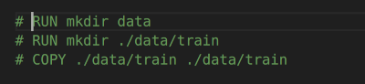

### Description
This is the capstone project for the DataTalks Club ML Zoomcamp 2024.

In this project we will build a traffic sign classification web service.

This web service will take images of traffic signs and classify them. This kind of service could also be used in a self driven car. The car cameras could scan the road for traffic signs and when they find one, the system can classify the sign so that the car could decide what to do. For example if the cameras find a STOP sign, the car would stop.

### Dataset

We will use the **GTSRB - German Traffic Sign Recognition Benchmark** dataset from Kaggle. The dataset can be found in the URL below:

https://www.kaggle.com/datasets/meowmeowmeowmeowmeow/gtsrb-german-traffic-sign

The two folders we are interested in, are:

* **Train**. All traffic sign images are stored here. You can find 43 folders, and in each folder you can find the images for a specific traffic sign. We will use this folder for model training.
* **Test**. We will use the images in this folder to test our model after it is trained.

### Tecnologies used

#### Jupyter notebook
  
Jupyter notebook is used run the **notebook.ipynb** file. We use this file for **Exploratory Data Analysis** and also for model evaluation and model selection.

#### Gunicorn
  
Gunicorn is s a Python WSGI (Web Server Gateway Interface) HTTP Server. The Flask application runs on this server.

### Flask
  
Flask is the framework which we use to create the prediction web service. 

#### Streamlit
  
Streamlit is used to create the user interface (UI). The user selects a traffic sign image file by using the **Browse** button or by just dragging the file and the output is displayed.

#### Docker
  
We use docker to create the containers for our app. We actually have two containers. One which contains the user interface and the script that allows us to connect to the predict service, and one which is actually our predict service.

#### Scikit-learn
  
We use the **scikit-learn** python library to handle data splitting.

#### Tensorflow
  
We use the **tensorflow** library to perform the model training.

### Application flow

Below you can see the application flow diagram.  

  

The user opens a browser and accesses a simple form which is actually a streamlit app. All the user has to do is select the desired traffic sign image **(png/jpg)** by using the **Browse** button or by just dragging the file. The streamlit app uses a function from the **predict_service_functions.py** file to connect to the web service **(predict_service.py)**. The connection is made by using the **/predict_traffic_sign** endpoint. The **predict** function uses the model **(traffic_sign_classification_model.h5)** to predict a traffic sign class. The traffic sign class with a short description is then returned to the user and displayed below the image selection box. The **init.py** script runs when the application starts. You can read more about this script in the **Run the application** section.

### Application structure

The following folders/files are included in the application:

* **app** folder. This folder contains all the files needed for the application to run.
* **data** folder. The application data file is stored here.
* **model** folder. The trained model **(traffic_sign_classification_model.h5)** is stored here.
* **docker-compose.yaml, Dockerfile.gunicorn** and **Dockerfile.streamlit** are used by docker to create the **UI** and **Predict Web Service** application containers.
* **requirements.streamlit.txt**. All python libraries with their versions, used by the UI container are stored here.
* **app.py**. This is the application entry point. It is the file that is loaded when the UI container starts.
* **predict_service_functions.py** This file contains the necessary functions to connect to the traffic sign classification web service.
* **requirements.gunicorn.txt**. All python libraries with their versions, used by the predict service container are stored here.
* **init.py**. This file is used to perform data preparation, to split the data into train and validation datasets, to train and finally save the model.
* **predict_service.py** This is the traffic sign classification web service. This service receives a traffic sign image in png/jpg format and returns a predicted traffic sign class.
* **notebook.ipynb** This is a Jupyter notebook file which was used for Exploratory Data Analysys and also for model evaluation and model final selection. After the best model is selected, this model is then used in the application.
* **README.md**. This file.

### Install Jupyter Notebook and Docker

#### Install Jupyter Notebook
To install Jupyter Notebook you can use the following link:

https://docs.jupyter.org/en/latest/install/notebook-classic.html

#### Install Docker and Docker Compose 
To install Docker and Docker Compose you can use the following links:

https://docs.docker.com/engine/install/  
https://docs.docker.com/compose/install/

### Run the application

#### Clone the github repository
Open a terminal, navigate to a folder where you want the repository files to be stored and then type:  

```console
https://github.com/sgkertsos/traffic-sign-classification.git
```

#### Download the dataset
Download the **archive.zip** file from the link below:

https://www.kaggle.com/datasets/meowmeowmeowmeowmeow/gtsrb-german-traffic-sign

and save it in the **app/data** folder.

In your terminal type:

```console
cd traffic-sign-classification/app/data
unzip archive.zip
```

#### Start the application

There are two possibilities here:

* Use the already trained model **(traffic_sign_classification_mode.h5)**  
  In **Dockerfile.gunicorn** comment out the following lines:

  

  **NOTE**
  This is the selected method to run the application because it saves you time, training the model.
  
* Train the model again. The training may take some time.
  In **Dockerfile.gunicorn** comment out the following line:
  
    

Start the application by typing the following commands:

```console
cd traffic-sign-classification/app
docker compose up
```
Wait for the application to load. 

After the application loading is done we have two docker containers running simultaneously:

* Gunicorn on port 9696    
* Streamlit on port 8501

When the Gunicorn docker container starts for the first time, the **init.py** script runs. In this script the following happen:

* Images are loaded
* Images are resized to 32x32 pixels and stored in the train-r folder.
* Dataset is split into train and test data
* A model with specific parameters is trained. The specific model and the specific parameters were selected after model evaluation was performed by using the **notebook.ipynb** Jupyter Notebook file.
* The model is saved under the filename **traffic_sign_classification_model.h5** in the **app/models** folder.

This model is then loaded by the traffic sign classification web service to predict house prices. 

**Note**  
The script checks if the model file **(traffic_sign_classification_model.h5)** file exists. If the file exists, the script will not perform the initialization process again.

### Access the user interface
Open your preferred browser and navigate to the following address:

http://localhost:8501

The application loads and you are presented with the house features form.

  
  
  

Fill in all the house features and the click on the **Calculate Price** button. The house price is displayed in the field below.

### Run notebook.ipynb Jupyter Notebook
If you want to check how the model evaluation was made, you can do it by opening the **notebook.ipynb** file in Jupyter Notebook and execute the code in each cell.

To start Jupyter Notebook make sure that you are in the **predict-house-price** folder and then type the following in your terminal:

```console
jupyter notebook
```
Copy the URL that is shown in your terminal and paste it in your preferred browser. The following picture appears. 

  

Double click on the **notebook.ipynb** file. The file is opened in a different tab. In this file we do the following:

* We load, clean the data and check for missing values.
* We perform Exploratory Data Analysis. 
* We setup a validation framework.
* We calculate feature importance.
* We train and evaluate three different models:
  * Linear Regression
  * Decision Tree  
    The model is evaluated for multiple **max_depth** values.  
  * Random Forest  
    The model is evaluated for multiple **max_depth** and **n_estimators** values.  
    
  RMSE is calculated for each model. The best RMSE is 0.065 for the Random Forest model.  

* We can fill in house features and use the Random Forest model to make a price prediction.  

Each notebook cell has a short description of what is actually done.

### Notes

#### Access docker container terminal
First you have to find the docker container id.

Type:

```console
docker ps
```
and note the container id, eg 68967bc26fc0

Copy the container id and then type:

```console
docker exec -it 68967bc26fc0 bash
```
You are now in the **/app** folder and you are ready to interact with the application files. If for example you are in the Gunicorn/Flask container, you can take a look at the **test.csv** file mentioned earlier.


